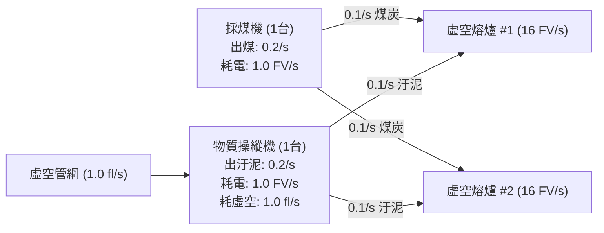
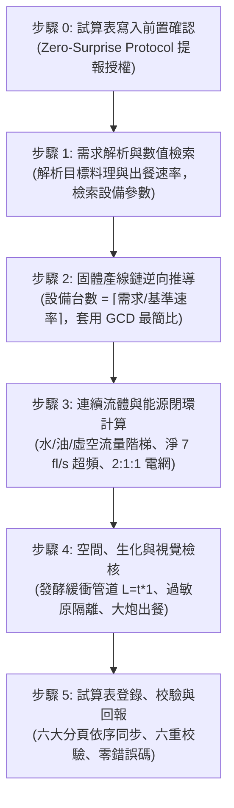

# 產線物理機制與平衡推導規範 (Production Logic & Physics Handbook)

本規範定義《Snacktorio》產線設計之「核心物理法則、物流機制、連續流體與即時電網平衡架構」，作為 AI 自動化架構師推導設備配比與實體佈線的最高物理準則。

---

## 一、 物流與空間運作原理

### 1. 固體物品物流
* **離散單位與等速運動**：固體物品以「個」為離散單位，在傳送帶上行進速度**恆定為 $1\text{ 格/秒 } (1\text{ tile/s})$**。此常數為計算發酵所需管線長度、緩衝距離與防腐壞時序之唯一物理基準。
* **吞吐量特性**：傳送帶本身吞吐量無上限，但流向分配受限於設備自帶輸出口或分流元件。
* **分流機制差異**：
  * **設備自帶輸出口**：若開啟多個出口，物料將被**嚴格均等整除**（如 1:1 或 1:1:1），無法自訂非對稱比例。
  * **專用分流器 (Splitter)**：具備比例調節功能，若產線需要非均等配比（如 2:1 或 3:1），必須依賴專用分流器。

### 2. 2D 空間與立體走線
* **垂直立體佈設**：產線規劃需考量高低落差，善用梯子、腳手架、單向跳台進行立體交叉走線，並繞行地圖中的合金壁與虛空裂隙。
* **終端出餐發射**：所有終端料理成品必須透過**送餐大炮（投食器/發射機）**直接發射至目標怪獸口中，各道料理出口需預留大炮配置空間。

---

## 二、 連續流體系統原理與專線直連鐵律

### 1. 即時連續流量特性
* **流體計量單位**：流體以 $\text{fl/s}$（Fluid 流率/秒）為連續計量單位。
* **常規設備流率**：常規轉化設備（如煮鍋、油炸鍋、自動廚師機）之流體消耗量恆定為 **$1.0\text{ fl/s}$**（即 5 秒週期固定消耗 5 fl）。
* **【重要特例】混合機 (Mixer)**：混合機加工週期為 4 秒，且單次僅消耗 2 fl，因此其持續流體流率固定為 **$0.5\text{ fl/s}$**。於計算外採流體需量時，混合機必須按每台 $0.5\text{ fl/s}$ 計算。

### 2. 機器無抽液上限與強制絕對均分定律
* **無抽液上限**：在連通的液體管網中，所有連接之需液設備**均無抽液上限**，無法依靠設備額定額外限制進液速度。
* **強制絕對均分**：管網內所有可用流體將會被連通的下游設備**絕對均等平分**。即使某些機器加工消耗較少（如混合機 $0.5\text{ fl/s}$），未充滿前仍會抽走平分到的全額流量，導致同管網內高需液設備（如發酵罐 $1.0\text{ fl/s}$）被稀釋而嚴重欠液停機。

### 3. 機內 500 fl 儲量緩衝機制
* **動態防瞬時欠壓**：每台需要液體的設備內部均內建 **$500\text{ fl}$ 的儲液槽**。當供給端平均流率 $\ge$ 消費端平均需量時，機內儲液槽將逐步充盈，能有效吸收管線震盪與週期性起伏，維持設備額定產能穩定運轉。

### 4. 流體基準速率換算與 1:1 獨立專線直供鐵律
* **單台基準速率 $C$ 物理定義 ($\text{Dishes/s}$)**：
  單台攪拌機產出為 $1.0\text{ fl/s}$ 持續流體。為與全庫固體設備量綱統一，其基準速率定義為「單台設備每秒可支援產出之料理份數」：
  $$C = \frac{1.0\text{ fl/s}}{\text{單份料理實質消耗流體總量 (fl)}}$$
  * **常規單路醬汁**（如塔瑪茄醬，單線需 $1.0\text{ fl/s}$，出餐速率 $0.2\text{ 份/秒}$ 下每份需 5 fl）：
    $$C = \frac{1.0}{5.0} = 0.20\text{ 份/秒}$$
  * **雙路/多路專線醬汁**（如單一醬汁同時供應 2 個工序端，每份需 10 fl）：
    $$C = \frac{1.0}{10.0} = 0.10\text{ 份/秒}$$
* **【1:1 獨立專線直連鐵律】**：
  若計算機算得某種醬汁實需台數為 2 台或多台時，在實體佈線中**嚴禁將多台攪拌機出口合流為單管**，必須鋪設相應數量的獨立 1:1 專用管道分別直連各個需求端。正因機器無抽液上限且管網強制均分，**嚴禁將不同流率需求、不同工序的設備併入未經 1:1 配對的共用管網**。

---

## 三、 雙階流體節點引擎與外採泵機階梯

外採流體（水、油、虛空）需依靠虛空泵機從地圖節點抽取。

### 1. 一級常規 vs 二級超頻規格

| 規格階梯 | 供液能力 | 運轉能耗 | 建造小妖精 | 燃料催化劑自耗 | 備註 |
| :--- | :--- | :--- | :--- | :--- | :--- |
| **一級常規泵機 (Tier-1)** | $2.0\text{ fl/s}$ | $1\text{ FV/s}$ | 1 個 | 無（零消耗） | 即插即用，適合小流量或低空間壓力 |
| **二級超頻泵機組 (Tier-2)** | 毛產出 $8.0\text{ fl/s}$ | $2\text{ FV/s}$ (泵機 1 + 操機 1) | 2 個 | 消耗虛空汙泥 $0.2\text{ 個/秒}$；物質操縱機自耗虛空 $1.0\text{ fl/s}$ | 抽虛空淨產出為 $7.0\text{ fl/s}$；抽水/油需跨網消耗虛空 |

### 2. 雙階流體節點智慧引擎 (Dual-Tier Fluid Node Engine)
為防止混合機（$0.5\text{ fl/s}$）與常規設備（$1.0\text{ fl/s}$）混管導致欠壓，實體供液節點實質需量 $K$ 公式為：
$$K = N(\text{常規 } 1.0\text{ fl/s 設備}) + \lceil \frac{N(\text{混合機 } 0.5\text{ fl/s 設備})}{2} \rceil$$
外採泵機之規劃需量恆為：
$$\text{外採泵機需量} = \max(\text{BOM 理論需量}, K)$$

### 3. 水 / 油泵機超頻決策門檻
* **全廠有虛空產線**：超頻門檻為 **$> 2.0\text{ fl/s}$**。因全廠已具備虛空管網，引流 $1.0\text{ fl/s}$ 供給操機成本極低，可直接啟用超頻以節約水/油節點格子。
* **全廠無虛空產線**：超頻門檻為 **$> 6.0\text{ fl/s}$**。若產線原先無虛空，為了水/油泵超頻必須額外建立一整套虛空泵機與物質操縱機供汙泥，在需求量 $\le 6.0\text{ fl/s}$ 時採用常規水/油泵更省電力與建造成本。

### 4. 虛空流體淨產出與閉環自耗模型
* **淨 $7.0\text{ fl/s}$ 超頻模型**：二級超頻虛空泵產出 $8.0\text{ fl/s}$，扣除供汙泥操機自身的 $1.0\text{ fl/s}$ 虛空自耗，全廠淨獲得 $7.0\text{ fl/s}$ 虛空流體。
* **自耗閉環回算**：產線啟用超頻泵機時，供汙泥操縱機所消耗的虛空流體必須 $100\%$ 回算至全廠虛空總需量中，由虛空泵機完全承擔。

---

## 四、 注入機原位轉化與衍生流體抽取鐵律

### 1. 注入機 (Injector) 原位轉化機制
* **機構分類**：轉化機器（運轉電力 $1\text{ FV/s}$，建造妖精 2 個）。
* **運作機制**：注入機直接放置於環境液體（如油池、水池）中，輸送帶每 5 秒輸入 1 個辛香料（$0.2\text{ 個/秒}$），將整片環境液體池**原位轉化**為目標衍生流體（如油池轉化為炙烈紅油、水池轉化為醋）。
* **外採防重疊計量原則**：原位轉化所需之底料（水/油）由注入機直接於池中轉化，**不計入全廠外採常規供水/供油管線中**，杜絕重複計算外採需量。

### 2. 衍生流體抽取泵機登錄鐵律
* **獨立抽取泵機配置**：經原位轉化後之流體池，必須在工序中配置專屬的「虛空泵機」抽取輸送（如「抽取炙烈紅油」單台產能 $2.0\text{ fl/s}$）。
* **單台基準速率折算**：依單台泵能 $2.0\text{ fl/s}$ 除以單份料理實質消耗流體折算為 Dishes/s（如消耗 7.5 fl 時為 $2.0 / 7.5 = 4/15\text{ 份/秒}$），確保電力 $1\text{ FV/s}$ 與妖精 1 個被精確納入，嚴禁漏算。

---

## 五、 即時電網平衡與發電熔爐 2:1:1 配置

### 1. 即時連續電力特性
* 電力無蓄電池緩衝，採即時產銷平衡，單位為 $\text{FV/s}$。
* 全廠總負載包含：主加工設備 + 外採泵機與轉化泵機 + 供汙泥操縱機 + 底料收割機 + 採煤機。

### 2. 虛空熔爐發電雙模與 2:1 物理平衡

* **常規發電模式 (4 FV/s)**：
  * 每台熔爐每 10 秒消耗 1 煤炭（$0.1\text{ 個/秒}$），發電 $4\text{ FV/s}$。
  * 採煤機產煤 $0.2\text{ 個/秒}$（耗電 $1\text{ FV/s}$），精確供應 2 台熔爐。
  * 採煤機與熔爐維持 **2:1 平衡**，單台熔爐扣除採煤耗電後**淨發電 $3.5\text{ FV/s}$**。
* **二級超頻發電模式 (16 FV/s) —— 2:1:1 閉環模組**：
  * 每台熔爐每 10 秒燃燒 1 煤炭 + 1 虛空汙泥，發電大幅飆升至 $16\text{ FV/s}$。
  * 標配 **2:1:1 發電模組**：2 台超頻熔爐（發電 $32\text{ FV/s}$）: 1 台採煤機（耗電 $1\text{ FV/s}$）: 1 台供汙泥物質操縱機（耗電 $1\text{ FV/s}$，消耗虛空 $1.0\text{ fl/s}$）。
  * 模組毛產電 $32\text{ FV/s}$，扣除採煤與操機自耗 $2\text{ FV/s}$，淨產電 $30\text{ FV/s}$，**單台等效淨發電達 $15.0\text{ FV/s}$**。
* **空載凝結免底料原則**：物質操縱機通電通虛空未指定目標或缺料空載時，虛空流體會自動凝結為虛空汙泥，故發電操機**完全不需要配置任何農作物底料收割機**。

---

## 六、 食材物理特性與生化反應法則

### 1. 非線性腐壞與機內暫存不跳計時
* **突變腐壞**：食材過期後將轉化為次級或衍生食材（如蛇蛋 30 秒腐壞為臭蛇蛋、軟質奶酪 20 秒熟成為中等熟成奶酪）。
* **【核心計時機制】**：食材在**機器內部（產出槽、暫存槽）停留時不會跳計時/不會推進腐壞與熟成**！僅當食材被輸出至傳送帶或管道流通時，計時器才正式啟動。產線可利用分揀機節奏取料或機內暫存，精準控制物流滯留時間。

### 2. 時序發酵緩衝管道計算
* **長度公式**：麵團類食材需在傳送帶上預留行進緩衝以完成發酵：
  $$\text{緩衝管道長度 (tile)} = \text{發酵所需時間 (秒)} \times 1\text{ 格/秒}$$
  例如麵包麵團需發酵 15 秒，則產線傳送帶必須鋪設至少 15 格距離。

### 3. 三大生化隔離原則
* **乳製品防熱凝固**：乳製品遇熱或辛辣介質會瞬間凝固堵管，相關管線必須與熱源徹底實體隔離。
* **過敏原獨立專線**：堅果與特定辛香料（如豆肉蔻）具強烈過敏原污染性，輸送帶必須建立獨立專線，禁止與一般原料共用分流通道。
* **氣味刺鼻與感染防護**：如小蒜、刺菠蘿等氣味刺鼻食材，以及具潛在食物中毒屬性之生熟食材（如生鷹身女妖肉需經擠出機剝皮加熱）必須維持專屬隔離迴路。

### 4. 多倍產出折算與開採鹽精度標準
* **多倍產出折算**：例如中等熟成奶酪於研磨機磨成 2 份芝士碎，單份料理消耗 0.5 奶酪（0.1 鹽）。若料理同時包含薯條 (1.0 鹽) 與芝士碎 (0.1 鹽)，單份料理共消耗 1.1 個鹽。
* **除不盡分數化**：採掘機基礎產能 $0.2\text{ 個/秒}$，單份消耗 1.1 鹽時，開採鹽基準速率必須以分數公式 **`=2/11`** 登記，杜絕浮點數截斷誤差。

---

## 七、 終端組裝配比鐵律與物理極限邊界

* **終端自動廚師機極限**：單道料理之終端輸入端上限恆為：
  * **最多 4 種固體食材**（配比恆為 $1:1:1:1$，單次組裝固定各消耗 1 個）。
  * **最多 1 種持續液體**（流率固定為 $1.0\text{ fl/s}$，或完全無液體）。
* **極限邊界定錨**：遊戲終端組裝絕不會出現第 5 種固體或第 2 種終端液體（其他液體必屬於中間烹調如油炸、水煮或攪拌）。這確立了試算表《食譜》分頁 17 欄位結構為終極標準，永久杜絕橫向無謂擴充。

---

## 八、 視覺狀態辨識準則 (Visual Indicators)

在觀察遊戲畫面或檢查產線運行時，依據以下指標判斷機器運作健康狀態：

* **中央運作圖標**：
  * 亮黃色：運轉中 (Active)。
  * 黑色 / 暗灰色：待機中 (Idle) 或飽和停機。
* **懸浮警報圖示**：
  * **白色對話框 + 紅色驚嘆號 (!)**：缺料或缺少對應液體。
  * **紅色旗幟 / 方塊 + 閃電符號 (⚡)**：缺電、電網超載或斷電。

---

## 九、 AI 產線計算標準推導流程 (6 步驟 SOP)

收到產線規劃需求時，AI 嚴格依循以下順序推導：

