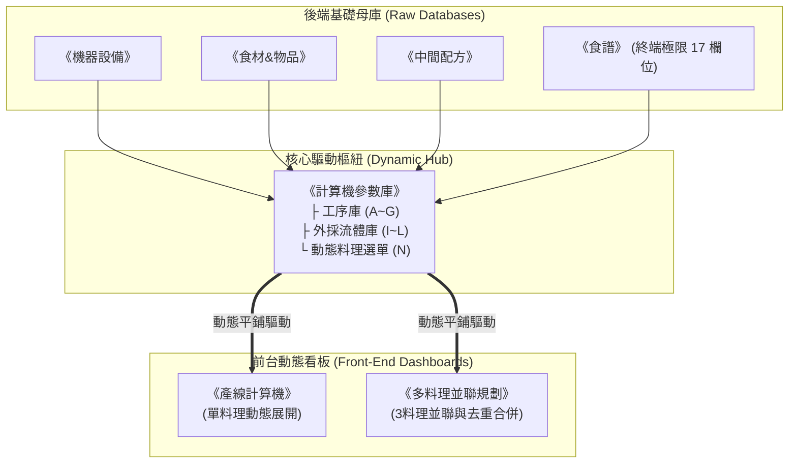

# 試算表架構與動態公式手冊 (Spreadsheet Architecture & Dynamic Formulas)

本手冊規範《Snacktorio 遊戲資料庫與生產規劃表.xlsx》的底層架構、前後端分離模型、動態公式演算法與儀表板標準佈局，確保系統具備極致的運算精度與全面自適應擴充能力。

---

## 一、 前後端分離與純資料庫驅動模型 (Data-Driven Only)



### 1. 純資料庫驅動核心理念
* **前台零修改**：前台《產線計算機》與《多料理並聯規劃》**嚴禁為了新增料理而手動插入行、改寫公式或增加巢狀 IF 特例判斷**。
* **參數庫統一平鋪**：所有新增食譜、加工工序、電力與妖精數據，一律以單行記錄平鋪登記至《計算機參數庫》。前台動態公式自動過濾、萃取並展開工序。
* **無界展開防碰撞規則**：前台雙計算機的工序展開區（Row 16+）下方為無界動態溢出區，**嚴禁在動態展開區下方放置任何靜態表格、附註文字或總計欄位**，避免工序展開時引發 `#REF!` 覆寫崩潰。

---

## 二、 試算表八大分頁架構與欄位規範

| 分頁名稱 | 定位與職責 | 標準欄位結構 | 維護與寫入規則 |
| :--- | :--- | :--- | :--- |
| **《機器設備》** | 全遊戲設備母庫 | `A: 設備分類` \| `B: 機器名稱` \| `C: 小妖精(個)` \| `D: 運轉電力(FV/s)` \| `E: 支援液體` \| `F: 液體流率(fl/s)` \| `G: 基礎產能` \| `H: 特殊機制說明` | 新機型依序向下登錄。小妖精為固定建造資本，電力為即時連續負載（FV/s）。注入機定錨為「轉化機器」。 |
| **《中間配方》** | 中間加工與異界重構母庫 | `A: 產物名稱` \| `B: 加工設備` \| `C: 所需液體` \| `D: 液體流量(fl/s)` \| `E~L: 固體原料1~4名稱與數量` \| `M: 週期時間(秒)` \| `N: 單次產量(個)` \| `O: 基礎速率(=N/M)` \| `P: 特殊備註` | 收錄非終端出餐的中間製品（如骨粉、生肉丸、芝士碎等）。擴充支援最多 4 種固體原料輸入（欄位至 P 欄），產出速率公式必須保持 `=N/M`。 |
| **《食材&物品》** | 物品屬性與生化規則庫 | `A: 所屬分類/島嶼` \| `B: 食材名稱` \| `C: 取得途徑` \| `D: 是否腐壞/發酵` \| `E: 腐壞時間(秒)` \| `F: 腐壞轉化產物` \| `G: 特殊屬性(過敏原/凝固/刺鼻/中毒)` \| `H: 說明備註` | 詳細記錄每項食材的物理特性（如過敏原隔離、發酵緩衝管道秒數、防凝固專線等）。 |
| **《食譜》** | 終端料理資料庫 | `A: 島嶼` \| `B: 料理名稱` \| `C: 加工設備(自動廚師機)` \| `D: 所需液體` \| `E: 液體流量(1 fl/s)` \| `F~M: 固體原料1~4與數量(恆為 1:1)` \| `N: 時間(5秒)` \| `O: 產量(1個)` \| `P: 產出速率(=O/N=0.2)` \| `Q: 注意事項` | 僅登錄怪物點餐之終端料理。17 欄位架構已正式確立為終極定錨標準，嚴禁隨意變更欄位定義。 |
| **《圖片對照表》** | 視覺資產庫 | `A: 類別` \| `B: 名稱` \| `C: 遊戲圖示` \| `D: 功能說明/特性備註` | **【終端料理收錄禁令】**：本表僅收錄實體機器、基礎原料與中間半成品，**嚴禁收錄終端菜餚/料理**！新食譜免建立終端成品圖示。 |
| **《計算機參數庫》** | 前後端分離的核心樞紐 | **工序庫 (A~G 欄)**：料理名稱、工序名稱、使用設備、單台基準速率 (Dishes/s)、單台電力、單台小妖精、排序。<br/>**食材庫 (I~L 欄)**：料理名稱、食材名稱、單份消耗量、類型 (固體/液體)。<br/>**選單 (N 欄)**：`N1` 標題、`N2` "(無)"、`N3` `=FILTER('食譜'!$B$2:$B, '食譜'!$B$2:$B<>"")`。 | 前台雙看板的唯一資料來源。單台基準速率遇除不盡循環小數時，**強制以分數公式（如 `=1/3`, `=2/11`）填寫**。混合機流體於食材庫折算為 $0.5\text{ fl/s}$。原位轉化流體必須獨立登記抽取泵機。 |
| **《產線計算機》** | 單料理動態規劃看板 | 頂部控制面板 (Row 1~4)、標準四區儀表板 (Row 7~13)、動態工序表 (Row 16+)。 | 純前台看板。完全由《計算機參數庫》驅動，下方保持空白無界展開。 |
| **《多料理並聯規劃》** | 多料理並聯排程看板 | 頂部控制面板 (Row 2~5，支援最多 3 道菜單)、標準四區儀表板 (Row 7~13)、跨料理動態去重工序表 (Row 16+)。 | 純前台看板。支援跨料理自動去重合併設備、計算並聯實需台數與節省設備台數。 |

---

## 三、 儀表板標準四區架構規範 (Row 7~13)

雙計算機前台的 Row 7~13 採用統一、解耦且對稱的四大模組劃分：

```
+--------------------------+-----------------------+-----------------------------+-------------------------------+
| 左區：全廠綜合總結算     | 中區一：廠內調配醬汁  | 中區二：原位轉化流體泵機    | 右區：外採泵機流體與超頻階梯   |
| (A~D 欄)                 | (E~G 欄)              | (H~L 欄)                    | (M~Q 欄 / 並聯規劃對應欄位)  |
| 集中電力、設備、煤炭與妖精| 攪拌機 1:1 專線流體   | 注入機原位轉化衍生流體抽取  | 水、油、虛空智慧階梯與閉環自耗 |
+--------------------------+-----------------------+-----------------------------+-------------------------------+
```

### 1. 左區：全廠綜合總結算 (A~D 欄)
* **純電縱向累加**：$B9:B12$ 分別列出主設備電力、轉化泵機電力、外採泵機操縱機電力、採煤機電力。
* **全廠總電力負載公式**：
  $$B13 = \text{SUM}(B9:B12)$$
  發電超頻自耗已包含於系統電力中，嚴禁重複累計。
* **資源總覽**：右側 $D9:D13$ 集中展示實需主設備台數、發電熔爐數、採煤機數、每秒煤炭消耗量與全廠總小妖精數。

### 2. 中區一：廠內調配醬汁清單 (E~G 欄)
* **動態提取公式**：
  $$E9 = \text{IFERROR}(\text{UNIQUE}(\text{FILTER}(\text{'計算機參數庫'!}\$B\$2:\$B\$1000, (\dots) * (\text{'計算機參數庫'!}\$C\$2:\$C\$1000 = \text{"攪拌機"}))), \text{"無"})$$
* **專線需量統計**：
  $$G9 = \text{IF}(\text{OR}(E9=\text{""}, E9=\text{"無"}), 0, \text{SUMIF}(\$A\$17:\$A\$100, E9, \$I\$17:\$I\$100) \times 1.0)$$
  雙看板醬汁需量一律顯示「實體專線實需台數 $\times 1.0\text{ fl/s}$」，直接反映實體通水流量。無醬汁時標準化顯示「無 \| - \| 0」。

### 3. 中區二：原位轉化流體泵機 (H~L 欄)
* 針對注入機原位轉化之特殊流體（如炙烈紅油、醋），列出轉化池專屬抽取泵機數量與能耗，流率保留一位小數 (0.0)。

### 4. 右區：外採泵機流體與超頻階梯 (M~Q 欄)
* 橫向對齊水、油、虛空三大外採流體。
* **虛空總需量閉環公式**（以多料理並聯規劃為例）：
  $$K11 = \text{SUMIF}(B17:B100, \text{"物質操縱機"}, I17:I100) \times 1.0 + N9 + N10 + N11$$
  其中 $N9, N10, N11$ 為水、油、虛空啟用二級超頻時，供汙泥操縱機額外消耗之虛空流量。
* **底列電力結算**：$Q13$ 統一結算全廠泵機與供汙泥操縱機之總電力負載，直接直連回左區電網看板。

---

## 四、 動態工序表核心公式解析 (Row 16+)

### 1. 工序自動提取公式 (A 欄)
雙看板利用動態數組公式自動展開所需之全工序，放寬至 1000 行防止截斷：
```excel
=IFERROR(UNIQUE(FILTER('計算機參數庫'!B2:C1000, 
  ('計算機參數庫'!A2:A1000=$B$3) + 
  ('計算機參數庫'!A2:A1000=$B$4) + 
  ('計算機參數庫'!A2:A1000=$B$5)
)), "")
```

### 2. 需求流率公式 (統一標準化)
全面廢止針對攪拌機的硬編碼分支，改為直接除以《計算機參數庫》之單台基準速率 $C$ (Dishes/s)：
```excel
=IF(A17="", "", IF($B$3="(無)", 0, IFERROR($C$3 / INDEX('計算機參數庫'!$D$2:$D$1005, MATCH(1, ('計算機參數庫'!$A$2:$A$1005=$B$3)*('計算機參數庫'!$B$2:$B$1005=A17), 0)), 0)))
```
藉由參數庫中 $C = 0.20$ 或 $0.10$ 等嚴密物理定義，固體與流體設備計算邏輯徹底統一。

### 3. 並聯實需台數與設備整數比
* **並聯總需求流率**：$G17 = \text{SUM}(D17:F17)$。
* **全廠實需台數**：$I17 = \text{CEILING.MATH}(G17, 1)$。
* **最簡整數比推導**：
  $$O17 = \frac{I17}{\text{GCD}(I\$17:I\$50)}$$
  並依據比值於 $P$ 欄提供 1:1 直連或專用分流器 (Splitter) 之拓撲建議。

---

## 五、 除不盡數值分數化鐵律

當《計算機參數庫》中之單台基準速率（D 欄）或單份消耗量（K 欄）為無法整除之循環小數時（例如 $1/3, 1/6, 1/11, 2/11$ 等）：

> [!CAUTION]
> **嚴禁填入截斷或近似小數字串（如 0.3333333333 或 0.1666666667）！**
> 必須一律以分數公式填寫：
> - 研磨機磨 E127（消耗 0.5 粉紅仙子）：`=0.4`
> - 開採鹽採掘機（單份消耗 1.1 鹽）：`=2/11`
> - 擠出麵條（5秒產出3個）：`=3/5`
> - 三等分製程：`=1/3`

### 為什麼必須分數化？
1. **極致浮點精度**：Excel 底層 IEEE 754 雙精度浮點數若遭人為截斷，在執行 `CEILING.MATH`（或 `ROUNDUP`）時，極易因 $0.999999999$ 而誤進位，憑空多算一台設備。
2. **GCD 最簡比正確性**：整數比依賴無失真的比例換算，分數化能保證設備比值精確約分。
