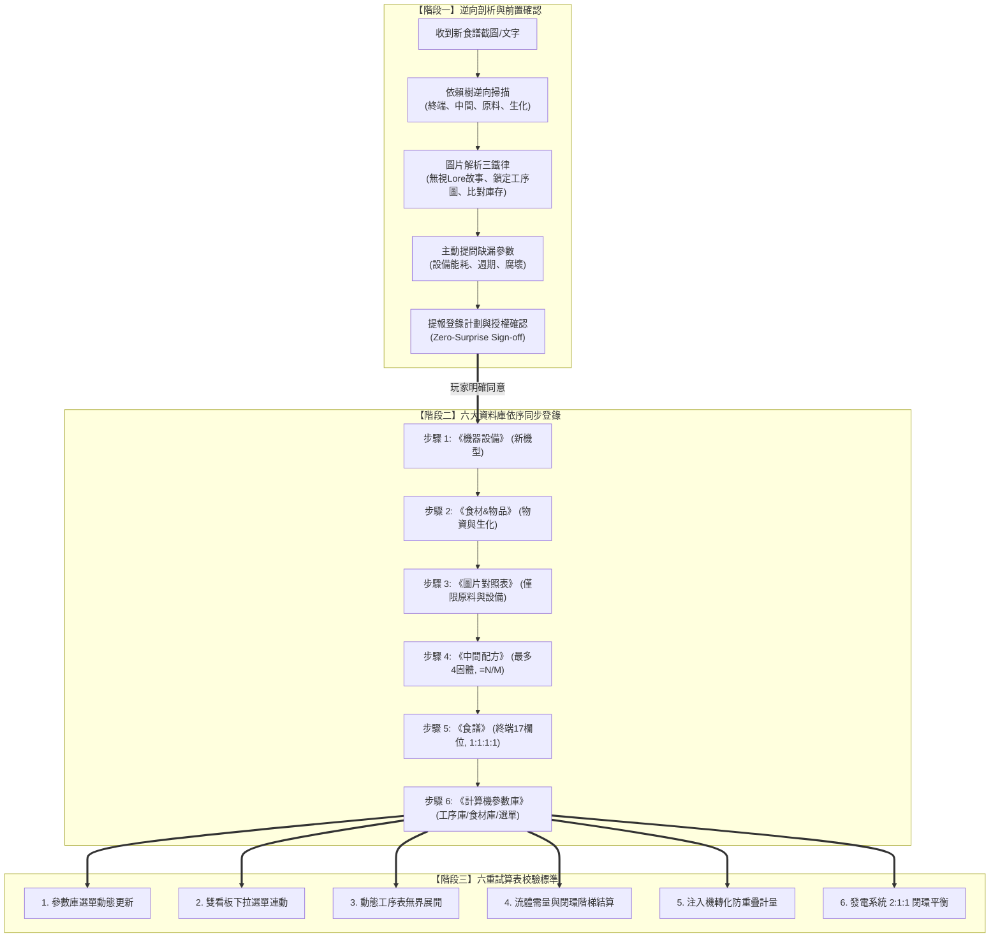

# 食譜登錄 SOP 與實戰範本 (Recipe Ingestion SOP & Case Studies)

本手冊規範當玩家向 AI 提供全新食譜（文字、截圖或圖片）時，AI 必須嚴格執行的逆向工程剖析、資訊提問、前置確認授權、六大分頁依序同步登錄流程與六重校驗標準。

---

## 一、 最高原則：前置確認與授權鐵律 (Zero-Surprise Protocol)

> [!IMPORTANT]
> **寫入前強制確認授權 (Zero-Surprise Sign-off)**：
> AI 或任何自動化助理在對試算表執行任何「寫入、修改、更新、清空或擴充」操作前，**必須主動向使用者提出明確的變更計劃**（說明目標分頁、儲存格範圍、修改內容、公式與計算影響），**獲得使用者明確確認同意後，方可調用工具執行寫入**。嚴禁未經確認逕行修改。

---

## 二、 新增食譜三階段標準作業程序 (SOP)

### 【階段一：未知資訊逆向剖析、提問補齊與前置確認】

1. **逆向依賴樹剖析 (Dependency Tree Scan)**：
   * **終端層**：料理名稱、製作週期（固定 5 秒）、產量（1 個）、持續液體需求（如特定醬汁 $1.0\text{ fl/s}$）、固體食材清單（最多 4 種固體，配比恆為 1:1:1:1）。
   * **加工層**：各前置食材如何取得？是否需要全新設備（如油炸鍋、發酵罐、注入機）？單次產量與週期？
   * **原料層**：地圖原生採集、異界重構（需虛空與底料）、還是生物發酵/腐壞衍生？
   * **生化屬性**：是否會腐壞（時限秒數與轉化產物）？是否發酵（所需緩衝管道長度）？是否有過敏原、遇熱凝固、刺鼻等特性？
2. **圖片解析焦點與視覺對照鐵律**：
   * **無視 Lore 故事文字**：左側大圖下方的背景故事純屬情境文字，非遊戲機制，必須完全忽略。
   * **鎖定功能圖示區**：聚焦右側工序流程圖與左側原料卡 (Ingredients)。
   * **強制對照現有庫存**：比對現有庫存配方與圖示，嚴禁憑空臆測。
3. **缺漏資訊主動詢問 (Ask for Clarification)**：
   * 若有未載明的參數（新設備能耗 FV/s、妖精數、加工週期、腐壞時限），整理成清晰問題清單向玩家確認。
4. **前置確認授權 (Zero-Surprise Sign-off)**：
   * 擬定包含各分頁目標儲存格座標、文字、數值與公式之登錄計劃，獲得玩家明確同意後方可寫入。

---

### 【階段二：六大資料庫依序同步登錄流程 (Sequential Ingestion)】

* **步驟 1：《機器設備》登錄（全新機型）**
  * 若涉及新設備，記錄分類、名稱、建造小妖精、運轉電力（FV/s）、支援液體種類與流率（fl/s）、基礎產能與特殊機制說明。
* **步驟 2：《食材&物品》登錄（全新物資與生化屬性）**
  * 記錄分類/島嶼、名稱、取得途徑、腐壞/發酵屬性（秒數與產物）、特殊隔離屬性（過敏原/遇熱凝固/刺鼻/中毒）與備註。
* **步驟 3：《圖片對照表》登錄（視覺資產）**
  * **【圖片簡化禁令】**：僅在涉及全新解鎖之加工設備或地圖原生採集食材時才建立圖示；**嚴禁收錄任何終端料理成品**！
* **步驟 4：《中間配方》登錄（加工製品與異界重構）**
  * 支援最多 4 種固體原料輸入（欄位順延至 P 欄），產出速率公式必須嚴格保持 `=N/M`。
* **步驟 5：《食譜》登錄（終端組裝料理）**
  * 僅登錄怪物點餐之終端菜餚。嚴格遵循 17 欄位定錨架構（固體原料 1~4 配比恆為 1:1，液體固定 1.0 fl/s，速率公式 `=O/N` 為 0.2）。
* **步驟 6：《計算機參數庫》登錄（核心驅動資料）**
  * **工序庫 (A~G 欄)**：記錄所有固體與流體工序，單台基準速率 $C$ 統一登記為 Dishes/s（遇循環小數強制以分數公式如 `=1/3`, `=2/11` 填寫）。原位轉化流體必須獨立登記專屬抽取泵機。
  * **食材庫 (I~L 欄)**：登記單份料理實質消耗之水、油、虛空流體總量。混合機流體按 $0.5\text{ fl/s}$ 折算。

---

### 【階段三：六重試算表校驗標準 (Verification Protocol)】

完成寫入後，強制執行以下六重檢核，確認前台完全無誤：

1. **參數庫選單動態更新**：確認《計算機參數庫》N 欄公式自動抓取到新料理名稱。
2. **雙看板下拉選單連動**：確認《產線計算機》與《多料理並聯規劃》下拉選單能正常選取該料理。
3. **動態工序表精準展開**：確認工序表自動展開對應設備、台數、電力與妖精，且無 `#N/A`、`#VALUE!`、`#REF!` 等錯誤碼。
4. **流體需量與閉環階梯結算**：檢查醬汁專線需量、水/油/虛空外採泵機數量與超頻供汙泥自耗是否正確結算。
5. **注入機轉化防重疊計量**：檢查原位轉化流體抽取泵機是否正確納入，外採常規管線是否杜絕重疊計量。
6. **發電熔爐 2:1 / 2:1:1 閉環平衡**：檢查全廠總電力與發電熔爐、採煤機、供汙泥操縱機台數是否維持標準物理平衡。

---

## 三、 核心防呆鐵律與防錯檢核清單

| 檢核項目 | 防呆標準與紅線禁令 | 違規後果與修復方式 |
| :--- | :--- | :--- |
| **圖片對照表收錄** | 嚴禁收錄任何「終端料理成品」，僅收錄實體設備與原生/中間物資。 | 避免視覺表過度膨脹，保持資料庫輕量純淨。 |
| **原位轉化抽取泵** | 凡經注入機原位轉化之流體，參數庫必須獨立登記專屬虛空泵機。 | 若漏登記，會導致前台漏算泵機能耗 (1 FV/s) 與小妖精 (1 個)。 |
| **混合機流體折算** | 混合機持續流率固定為 $0.5\text{ fl/s}$，食材庫折算需乘以 0.5。 | 若誤算為 $1.0\text{ fl/s}$，外採泵機需量將嚴重虛增高估。 |
| **循環小數填寫** | 遇到除不盡小數（如 1/3, 1/11, 2/11）必須使用分數公式填寫。 | 截斷小數會引發 Excel 浮點誤差，導致台數誤進位或 GCD 失真。 |

---

## 四、 黃金實戰範本：哀嚎肉丸登錄全流程 (Case Study)

以下記錄波莫拉島嶼料理【哀嚎肉丸】端到端標準作業示範：

### 1. 圖片逆向剖析與資訊提取
* **過濾背景故事**：忽略左側「流放熔火沼澤」故事文字。
* **鎖定原料卡 (Ingredients)**：提取塔瑪茄 1、日桂葉 2、豆肉蔻 1、綠色多刺生物 1、油 1 FL、虛空 1 FL。
* **鎖定工序流程圖**：
  * 工序 1：攪拌機（塔瑪茄 1 + 日桂葉 1 $\to$ 塔瑪茄醬 1 fl/s）。
  * 工序 2：混合機（綠色生物 1 + 豆肉蔻 1 $\to$ 生肉丸），油炸鍋（生肉丸 1 + 油 1 fl/s $\to$ 炸肉丸）。
  * 工序 3：自動廚師機（炸肉丸 1 + 日桂葉 1 + 塔瑪茄醬 1 fl/s $\to$ 哀嚎肉丸）。
* **日桂葉速率折算**：單份料理共需 2 片日桂葉（醬汁 1 + 終端 1），收割機基準速率設為 $0.20 / 2 = 0.10\text{ 份/秒}$。

### 2. 缺漏資訊主動詢問
提問玩家並確認：綠色生物為「綠色史萊姆」（5秒1個 0.2/s）；中間製品為「生史萊姆肉丸」（4秒1個 0.25/s）與「炸史萊姆肉丸」（5秒1個 0.2/s）；所屬島嶼為波莫拉；無過敏原與特殊生化屬性。

### 3. 前置確認授權 (Zero-Surprise Sign-off)
向玩家呈報完整登錄計劃（含各分頁寫入座標與公式），獲得玩家明確同意後執行寫入。

### 4. 資料庫依序同步寫入
* 《食材&物品》：登錄綠色史萊姆、生史萊姆肉丸、炸史萊姆肉丸。
* 《圖片對照表》：依據簡化原則，不建立哀嚎肉丸成品圖示。
* 《中間配方》：登錄生史萊姆肉丸（混合機）與炸史萊姆肉丸（油炸鍋）。
* 《食譜》：登錄哀嚎肉丸（自動廚師機，炸史萊姆肉丸 1 + 日桂葉 1，塔瑪茄醬 1 fl/s，出餐速率 0.2 份/秒）。
* 《計算機參數庫》：平鋪工序庫 8 道工序與食材庫水、油、虛空需量。

### 5. 六重校驗結果
確認 N 欄選單動態更新，前台計算機在出餐速率 $0.2\text{ 份/秒}$ 下精準展開 9 台主設備，外採油 1 fl/s、虛空 1 fl/s，發電採煤維持 2:1 平衡，零錯誤碼。

---

## 五、 進階實戰案例：斯科瓦拉原位轉化與氣味刺鼻菜譜

### 案例 1：【驚嚇醃薑】（注入機原位轉化與 E127 刺鼻支線）
* **終端組裝**：自動廚師機（5秒/份，基準速率 0.2 份/秒），消耗 醋 x1、姜姜 x1、E127 x1。
* **甘酒與醋支線（原位轉化原則）**：水稻經發酵罐發酵為甘酒（耗水 $1.0\text{ fl/s}$）；再經注入機於水池原位轉化為醋。注入機轉化醋不計入外採常規供水管線，全產線外採水需量僅為發酵甘酒之 $1.0\text{ fl/s}$，配置 1 台常規水泵。
* **氣味刺鼻 E127 支線**：物質操縱機耗虛空（$1.0\text{ fl/s}$）重構粉紅仙子（5秒/個），再經研磨機磨成 2 份 E127（具氣味刺鼻隔離屬性）。因每份料理消耗 0.5 仙子，物質操縱機有效基準速率為 $0.4\text{ 份/秒}$。

### 案例 2：【爆烈雞肉飯】（多倍產出沙沙醬與中毒屬性）
* **終端組裝**：打工小妖炒飯 1 + 生鷹身女妖肉 1 + 菠菜 1 + 辛辣沙沙醬 1，通入炙烈紅油 $1.0\text{ fl/s}$。
* **生鷹身女妖肉**：鷹身女妖翅膀由物質操縱機重構，再經擠出機剝皮成型，具食物中毒屬性，需專屬衛生處理線路。
* **辛辣沙沙醬**：洋蔥蔥、塔瑪茄與炙烈紅油於混合機混合雙倍產出（4 秒 2 個）。
* **外採流體閉環**：油 3 fl/s（油炸鍋 $1.0\text{ fl/s}$ + 油池轉化紅油 $2.0\text{ fl/s}$ = $3.0\text{ fl/s}$）、虛空 1 fl/s（物質操縱機）。
